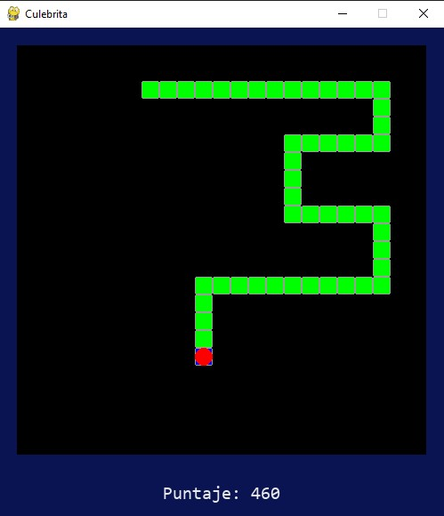

# Juego de la culebra
**Author: Ing Juan David Díaz**

Juego realizado en Python 3.10.0 con pygame 2.1.2
Juego retro de la culebra

**Contenido**
- Main.py
- Juego.py
- Culebra.py
- Parte.py
- Fruta.py

## Imagenes

